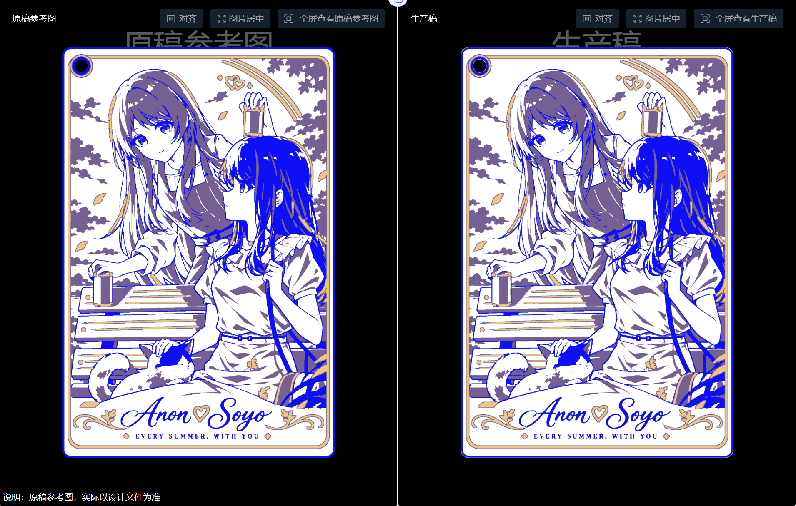

# PCB_ART

`PCB_ART` 是一个面向 Codex 的 PCB 艺术画与谷子制作 skill。它把角色参考图整理成可制造的双面 PCB 图层，重点处理阻焊、白丝印、沉金开窗、异形板框、挂孔、正反面方向和生产稿检查。

默认优先采用 **2 层沉金（ENIG）＋单色阻焊＋白丝印**。如果用户已经确定使用 OSP、彩色丝印或其他工艺，则按已确认工艺执行。

## 能做什么

- 从原图提取正面、背面和角色识别细节
- 把头发、五官、服装、装饰和文字分配到铜层、阻焊开窗和白丝印
- 处理自然发束分界、局部噪点、脚趾、猫耳、羽饰和花体字
- 生成 KiCad PCB、Gerber、钻孔、双面预览和局部检查图
- 检查背面镜像、板框、挂孔、层间一致性与局部差分
- 区分本地文件验证、嘉立创导入、厂家 CAM 和实物打样状态

## 展示

下面是两个实际板画案例的“原稿参考图 / 生产稿”对照。展示图用于说明工作流和图层转译效果；其中角色与原始素材的版权不随本仓库代码许可转移。

### 爱音 × 素世：蓝色双面板画



### 哥伦比娅 × 桑多涅：紫色 OSP 异形板画


## 使用

将本仓库作为 skill 目录安装，使 `SKILL.md` 位于 skill 根目录，并保留 `agents/` 与 `references/`：

```text
~/.codex/skills/pcb-art-enig/
├─ SKILL.md
├─ agents/openai.yaml
└─ references/
```

在 Codex 中可使用 `$pcb-art-enig` 调用，也可以直接描述要制作或精修的 PCB 艺术画。

仓库内的 `PCB_ART.zip` 是同一 skill 的便携压缩包。

## 交付边界

skill 可以生成和检查本地 PCB、Gerber、钻孔及预览文件，但不会自动上传、下单、付款或替用户确认厂家生产稿。预览中的阻焊颜色和铜层明暗是示意，实际颜色、细丝印和耐磨性需要以厂家 CAM 与实物打样为准。

## 文件结构

```text
SKILL.md                 主指令
agents/openai.yaml       Codex 显示与调用配置
references/design.md     图层、材料与沉金设计
references/fabrication.md制造文件与生产稿核查
references/refinement.md 局部精修与视觉验收
references/local-example.md本机案例与资源说明
assets/                  展示图片
PCB_ART.zip              便携 skill 包
```

## License

本仓库中的 skill 指令与配套文字采用 MIT License。`assets/` 中的案例图片仅用于展示，相关角色、原图和生产稿素材的权利归其相应权利人所有。
